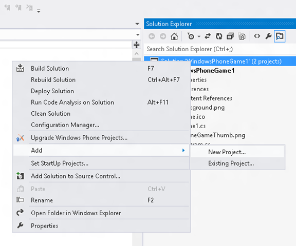
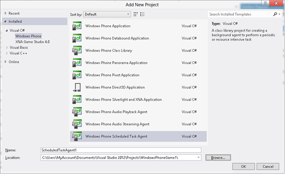
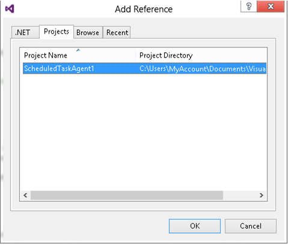
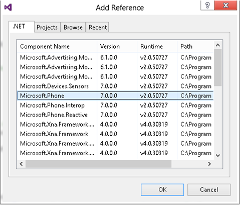



# Adding a Windows Phone Background Agent to an XNA Game

This topic describes the steps required to add a Windows Phone background agent to an XNA Framework game.

Note

This topic does not describe programming background agents in detail. For more detailed information, see [Background Agents for Windows Phone](http://go.microsoft.com/fwlink/?LinkId=254753) in the Windows Phone documentation.

Background agents, implemented by the Windows Phone [BackgroundAgent](http://go.microsoft.com/fwlink/?LinkID=219521) class, can be used to perform background actions for XNA Framework games by adding a background agent to your existing Windows Phone game project.

Background agents are only available for games that target Windows Phone 8.0. For more information about creating a project that targets Windows Phone 8.0, see [Creating a Windows Phone Game or Library Project](UsingXNA_CreatingMobileProject.md).

*   [Creating a New Background Agent](#ID4EFC)
*   [Adding Necessary References to Your Game Project](#ID4EBF)
*   [Updating WMAppManifest.xml with Extended Task Information](#ID4EEAAC)
*   [Scheduling the Background Agent in Your Game Code](#ID4EWBAC)

# Creating a New Background Agent

Before you can use a background agent in your game, you need to create one. This can be done by adding a new Task Scheduler Agent to your game's solution in Microsoft Visual Studio.

### To add a new background agent to your game

1.  In **Solution Explorer**, right-click the game solution, click **Add**, and then click **New Project**.
    
    
2.  In the **Add New Project** dialog box, click **Windows Phone**.
    
    A list of project types, including **Windows Phone Scheduled Task Agent**, is displayed.
    
    
3.  Click **Windows Phone Scheduled Task Agent**, type the name of your project, and then click **OK**.
    
    This adds a new Scheduled Task Agent project and class to your solution.
    
    Note
    
    While this example uses the Scheduled Task Agent, any of the other background agent project types can also be used.
    

# Adding Necessary References to Your Game Project

Next you need to add references to the newly created background agent _and_ to the Microsoft.Phone assembly in your game project.

### To add a reference to the background agent project

1.  In your game project, right-click the **References** node, and then click **Add Reference**. The **Add Reference** dialog box opens.
    
2.  On the **Projects** tab, click the Scheduled Task Agent you created in your solution, and then click **OK** to add it to your game.
    
    
    
    Note
    
    Alternatively, you can add a pre-built background agent assembly to your game by using the **Browse** tab to search for it. This topic assumes, however, that you've created a new background agent project specifically for your game.
    

### To add a reference to the Microsoft.Phone assembly

1.  In your game project, right-click the **References** node and click **Add Reference**. This opens the **Add Reference** dialog box.
    
2.  On the **.NET** tab, click **Microsoft.Phone** in the list of components, and then click **OK** to add the reference to your game project.
    
    

# Updating WMAppManifest.xml with Extended Task Information

Next you need to add extended task information to the WMAppManifest.xml file.

### To add extended task information to WMAppManifest.xml

1.  In your game project open the **Properties** node and double-click on the WMAppManifest.xml file.
2.  Locate the Tasks element and create an ExtendedTask child node like this, replacing instances of SchedulerAgent1 with the name of your new agent.
    
    <Tasks>
       <DefaultTask Name="_default"/>
       <ExtendedTask Name="BackgroundTask">
          <BackgroundServiceAgent Specifier="ScheduledTaskAgent" Name="SchedulerAgent1" Source="SchedulerAgent1" Type="SchedulerAgent1.TaskScheduler" />
       </ExtendedTask>
    </Tasks>
                   
    

# Scheduling the Background Agent in Your Game Code

Once the background agent is added to your game, you must add it to your game code so it can be scheduled.

### To use the background agent in your game code

1.  In the source file you'll be using to schedule the background agent, add a `using` statement for Microsoft.Phone.Scheduler before your class or namespace declaration.
    
                          `using Microsoft.Phone.Scheduler;` 
                        
    
2.  Use **ScheduledActionService.Add** to schedule the task for execution at a predefined interval or based on phone events such as idling. For example, respectively:
    
                          `ScheduledActionService.Add(new PeriodicTask("Periodic") { Description = "UXDescription" });
                     
    ScheduledActionService.Add(new ResourceIntensiveTask("Idle"));` 
                        
    

# See Also

#### Topics in the Windows Phone Documentation

[Background Agents for Windows Phone](http://go.microsoft.com/fwlink/?LinkId=254753)  
[Alarms and Reminders Overview for Windows Phone](http://go.microsoft.com/fwlink/?LinkID=219560)  
[BackgroundAgent Class](http://go.microsoft.com/fwlink/?LinkID=219521)  

© 2012 Microsoft Corporation. All rights reserved.  
Version: 2.0.61024.0